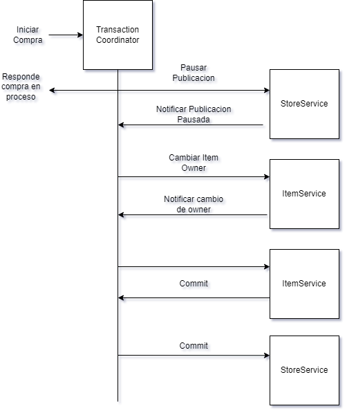
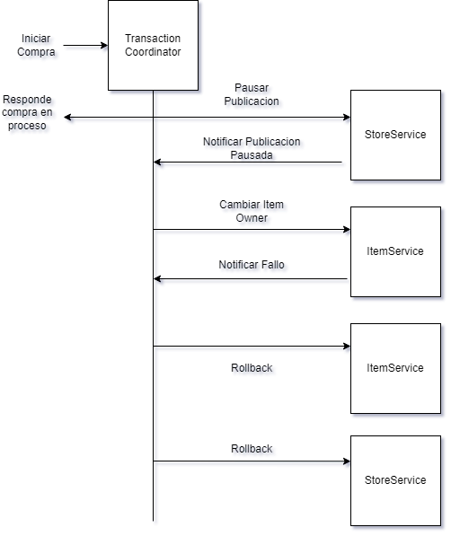

## Ejemplo de transacción distribuida utilizando el metodo "Two Phase Commit"


### Transacción en un modelo monolitico
```java
public void comprar(Long compradorId, Long publicacionId) {
    var tx = beginTransaction();
    try {
        var publicacion = publicacionService.findById(publicacionId);
        var comprador = personajeService.findById(compradorId);
        var vendedor = personajeService.findById(publicacion.getVendedor().getId());
        
        vendedor.vender(publicacion, comprador);
        
        publicacionService.save(publicacion);
        personajeService.save(comprador);
        
        tx.commit();
    } catch (Exception e) {
        rollback();
        throw e;
    }
}
```

### Transacción en un modelo distribuido

#### Caso favorable



#### Caso desfavorable


